# spring-boot-kafka

This simple application connects to a kafka cluster and publishes and subscribes messages from a kafka topic. 

## Local kafka setup

The steps outlined below are for MAC users.

1. `bew install kafka`
2. Start zookeeper using brew services: `brew services start zookeeper`
   
   If you don't want to run it as a background service you can just run : `zookeeper-server-start /usr/local/etc/kafka/zookeeper.properties`
3. Now start kafka using brew services: `brew services start kafka`
   
   If you don't want to run it as a background service you can just run : `kafka-server-start /usr/local/etc/kafka/server.properties`
4. To view the services: `brew services list`
5. To stop zookeeper & kafka using brew services 
   
   ```
    brew services stop zookeeper
    brew services stop kafka
   ```

***NOTE: Brew services will keep the services running in the background. So the services will be running at all times.***
    
## Testing local kafka using command line tools

In this section we will create a topic, a producer and a consumer and test the flow using kafka command line tools. 

1. Create a topic named `book-update`

   `kafka-topics --create --zookeeper localhost:2181 --replication-factor 1 --partitions 1 --topic book-update`
   
2. Create Producer console and send messages to the topic `book-update`

   `kafka-console-producer --broker-list localhost:9092 --topic book-update`
   
   You will see `>` once you run the above command. Now you can type in the messages that you want to send. An example is shown below.
   
   ```
   >First book update
   >second book update
   ```
3. Create Consumer console which will listen to localhost at port 9092 at topic `book-update` 

   `kafka-console-consumer --bootstrap-server localhost:9092 --topic book-update --from-beginning`
   
   Example output of the above command
   
   ```
    First book update
    second book update
   ```
 
## Kafka Tool setup

We are going to use Kafka Tool as a GUI for managing and using Kafka cluster. It is a free tool as long as you are not using it for commericial purposes.

***NOTE: Do not use this tool for any commericial purposes without purchasing a license*** 

1. Download link for the tool - https://www.kafkatool.com/download.html
2. Once you have installed the software on your machine open the tool to setup the connection details. 
   ```
   Zookeeper Host : localhost
   Zookeeper Port : 2181
   ```
   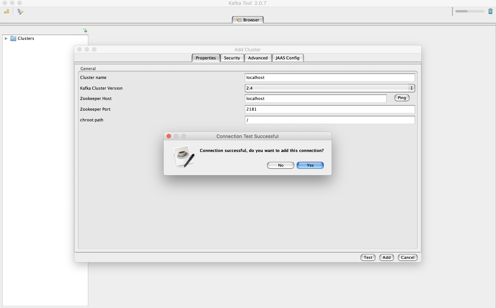
   
3. Inside topics section you will see the `book-update` topic that we created earlier with the command line tool. When you click on the Data tab and click on `Retrieve messages` which looks like a play button to see the messages added earlier. Notice that by default the messages are displayed in bytes. In the next step we will convert it to string.  

   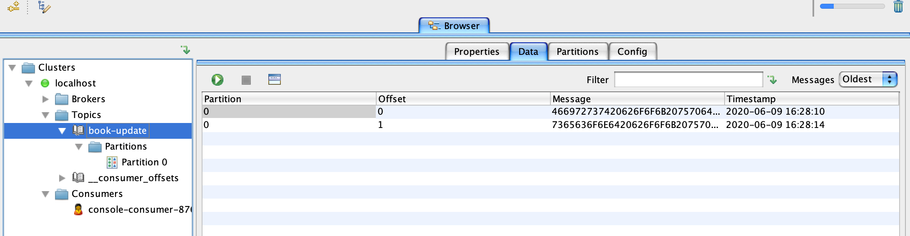
   
4. To change from byte to string switch over to the properties tab and change both key and message to string and click update as show in the below screenshot.
   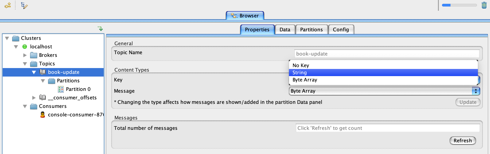
   
5. Messages displayed in string.
   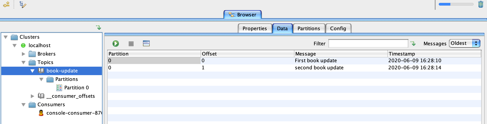
   
## Sending message using Kafka Tool UI
Now let's try to send a message using Kafka Tool UI.
1. Click on partition 0 under your topic name and then switch over to the Data tab and click on the plus sign and add single message.
   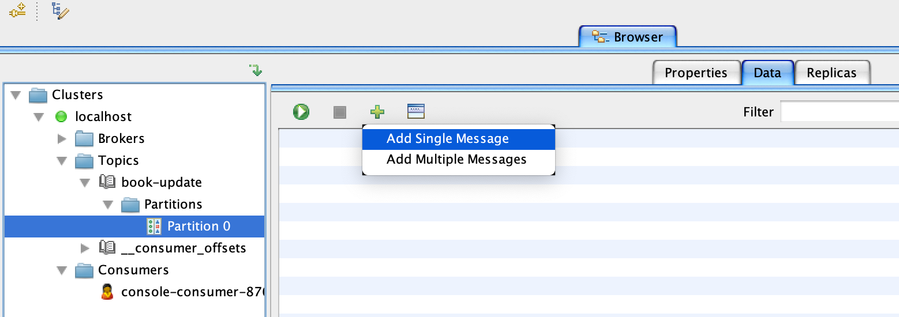
   
2. For both `key` and `value` section switch from `from file` to `Enter manually [HEX]`. In the below screenshot example i didn't give a value for `key`. Click on Add and you can keep adding messages if you want to.
   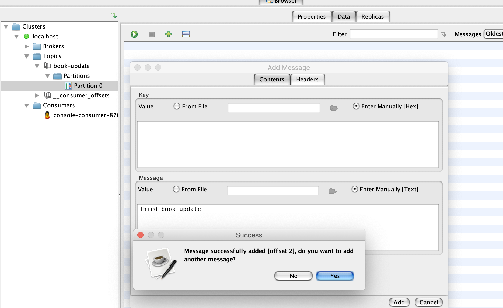

3. Now click on the topic name which in this case is `book-update` and switch to the data tab. Click on `Retrieve messages` which looks like a play button to see the new meessages added from the previous step.

## Spring-boot classes 
1. 
   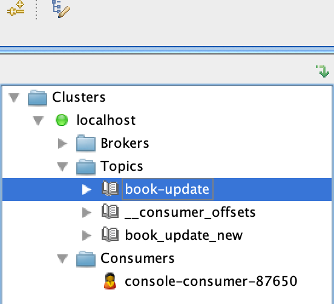
      
2. 

3. 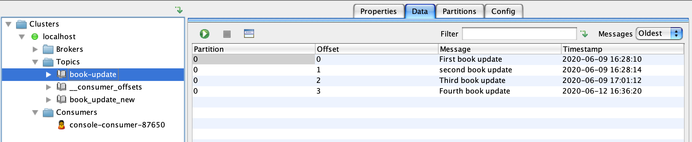

4. 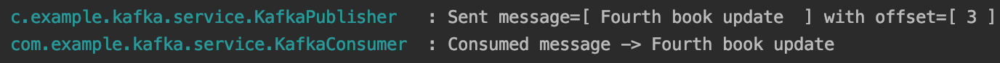

5. 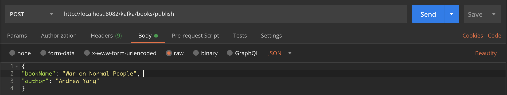

6. 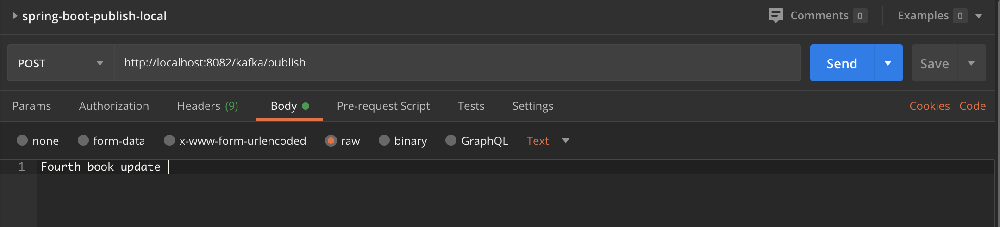


